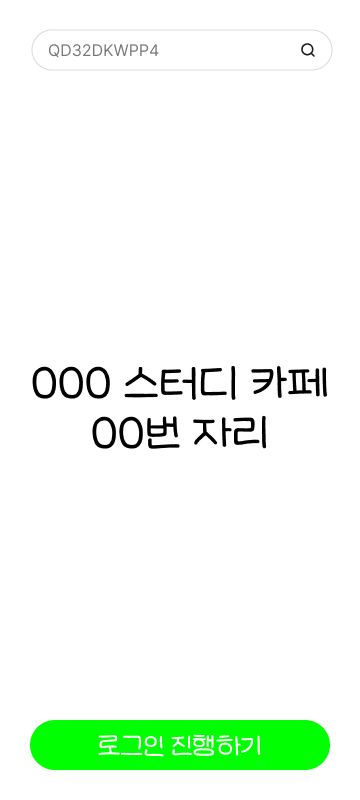

📱 SSM 로그인 전용 앱

이 애플리케이션은 SSM 프로그램을 사용하기 위한 로그인 전용 앱입니다. 사용자는 간편하게 카카오톡으로 로그인한 뒤, QR 코드 스캔 또는 수동 고유번호 입력을 통해 자신의 기기에 접속할 수 있습니다.

✨ 주요 기능
•	카카오톡 로그인: 카카오 계정을 통해 손쉽게 인증
•	QR 코드 스캔: 지정된 기기의 QR 코드를 스캔하여 빠르게 로그인
•	수동 고유번호 입력: QR 스캔이 어려운 경우, 고유번호를 직접 입력해 로그인 가능
•	자동 연결: 로그인 후, 사용자가 지정한 기기로 즉시 연결

🛠 기술 스택
•	Flutter: 멀티 플랫폼 UI 프레임워크
•	GetX: 상태관리 및 라우팅
•	mobile_scanner: QR 코드 인식
•	kakao_flutter_sdk: 카카오톡 OAuth 로그인
•	Dart: 앱 로직 및 상태 관리

🖼 화면 미리보기

|                    로그인 화면                     |                   QR 스캔 화면                   |                    수동 입력 화면                     |                         접속 완료 화면                          |
|:---------------------------------------------:|:--------------------------------------------:|:-----------------------------------------------:|:---------------------------------------------------------:|
|  |  |  |  |